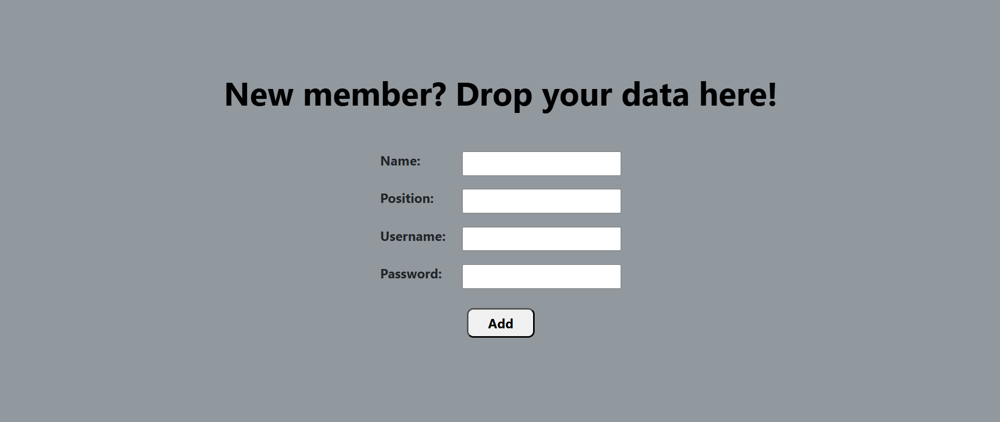
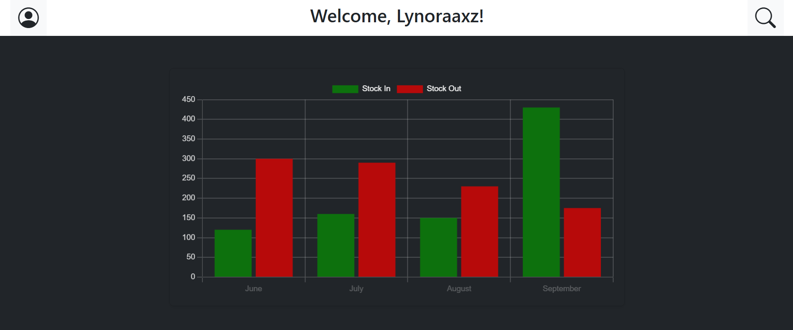
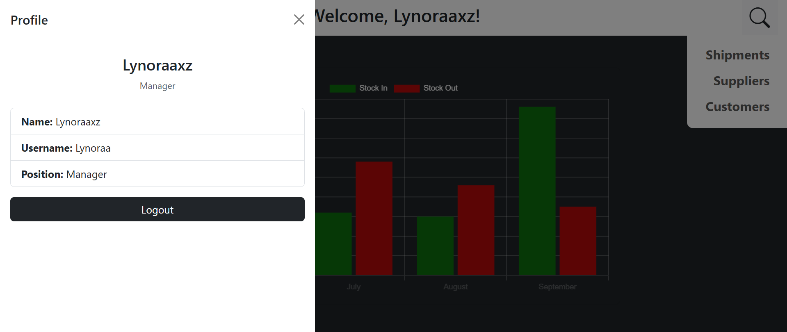
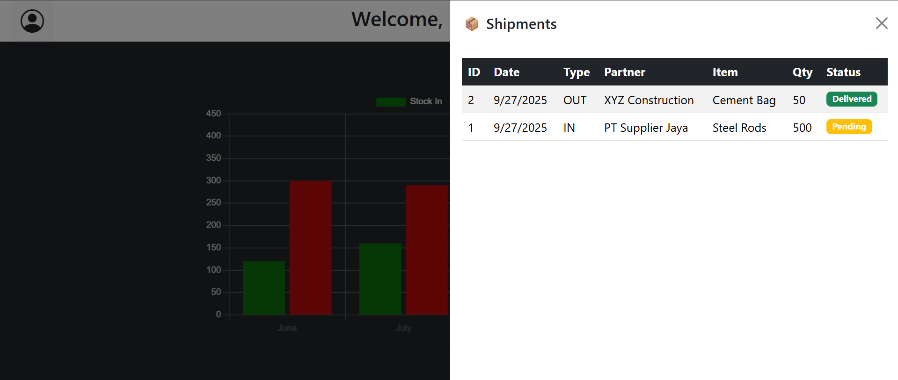
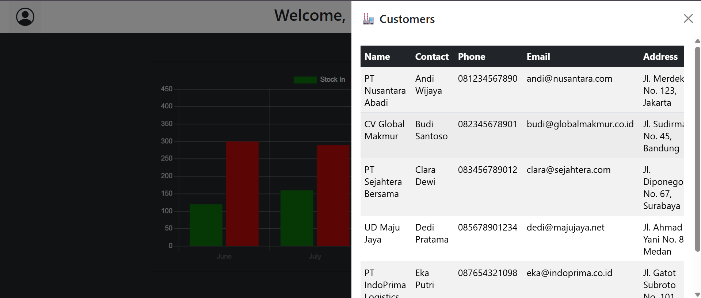
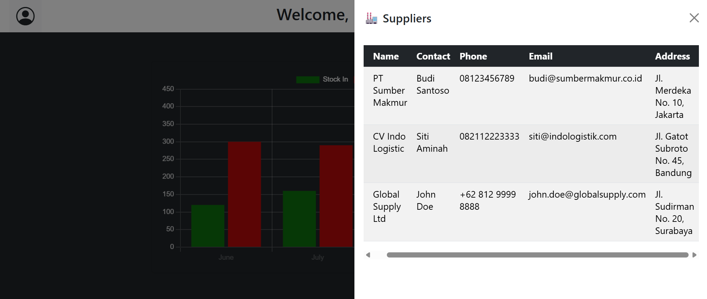

# 📦 Mini Logistics Website

A simple web-based logistics management system built with **Node.js**, **Express**, and **MySQL**.  
This project demonstrates how to connect a backend to a relational database, handle transactions, and display data with a clean web interface.  

---

- 🔑 User authentication (login/register)  
- 📊 View stock in/out history with charts  
- 🚚 Track shipments, suppliers, and customers  
- 📱 Responsive frontend design (works on desktop & mobile)  
- 🗄 MySQL integration with CRUD operations  

---

## 🛠 Tech Stack
- **Frontend**: HTML, CSS, JavaScript  
- **Backend**: Node.js, Express  
- **Database**: MySQL  
- **Deployment**: (Demo only, not live hosted)  

---

## 📸 Demo
### Screenshots
  
  
  
  
  
  
  

### Video/GIF
[Download MP4](./Assets/LogisticsDemo.mp4)
---

## ⚙️ Installation
Clone and run the project locally:  

```bash
# Clone the repository
git clone https://github.com/lynoraaxz/Mini-Logistics-Website.git

# Enter project folder
cd mini-logistics-website-lynoraaxz

# Install dependencies
npm install

# Setup environment variables
cp .env.example .env
